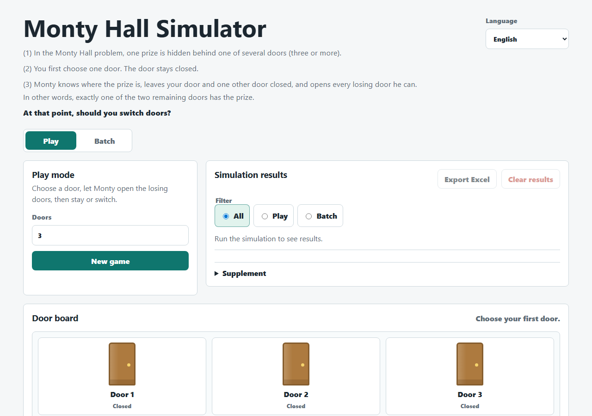

# 몬티 홀 시뮬레이터

브라우저에서 몬티 홀 문제를 실험할 수 있는 정적 다국어 도구입니다. GitHub Pages로 바로 배포할 수 있습니다.



- 라이브 사이트: [시뮬레이터](https://piccoripico.github.io/monty-hall-simulator/)

## Multilingual Documents

- [English](../README.md)
- [日本語](README.ja.md)
- [Français](README.fr.md)
- [Español](README.es.md)
- [Deutsch](README.de.md)
- [简体中文](README.zh-Hans.md)
- [繁體中文](README.zh-Hant.md)

## 몬티 홀 문제란?

몬티 홀 문제는 닫힌 문들 중 하나를 고르는 확률 퍼즐입니다. 여러 문 중 하나 뒤에는 상품이 있고, 나머지 문 뒤에는 상품이 없습니다. 당신이 먼저 문 하나를 고르면, 상품 위치를 아는 몬티가 꽝 문을 열고 당신이 고른 문과 다른 닫힌 문 하나를 남깁니다.

놀라운 질문은 첫 선택을 그대로 둘지, 아니면 남은 다른 닫힌 문으로 바꿀지입니다. 이 시뮬레이터는 그 실험을 여러 번 실행하고, 생성된 모든 시행을 확인하며, 관측 결과를 이론적 확률과 비교할 수 있게 해 줍니다.

## 기능

- 문을 클릭해 직접 한 라운드를 진행하는 Play 모드.
- 문 수는 3개부터 1,000개까지 선택할 수 있습니다.
- 바꾸지 않기만, 바꾸기만, 또는 두 전략 모두를 전략별 최대 100,000회 실행하는 Batch 모드.
- Mode 열과 All / Play / Batch 필터가 있는 공유 시행 목록.
- 통계 결과와 전체 시행 행을 Excel로 내보내기.
- KaTeX로 표시되는 조건부 확률과 베이즈 공식 보충 설명.
- 영어, 프랑스어, 스페인어, 독일어, 일본어, 간체 중국어, 번체 중국어, 한국어 UI.

## 개발

```powershell
npm.cmd install
npm.cmd run verify
```

유용한 스크립트:

- `npm.cmd test`: 단위 테스트와 i18n 테스트를 실행합니다.
- `npm.cmd run build`: 정적 앱을 `dist/`로 복사합니다.
- `npm.cmd run test:e2e`: `dist/`를 대상으로 Playwright 테스트를 실행합니다.
- `npm.cmd start`: `dist/`를 <http://127.0.0.1:4174/> 에서 제공합니다.

PowerShell에서 `npm`이 차단되면 위와 같이 `npm.cmd`를 사용하세요.

## GitHub Pages

`.github/workflows/pages.yml` 워크플로는 `main`에 push하거나 수동 실행할 때 빌드, 테스트, `dist/` Pages artifact 업로드를 수행합니다.

GitHub Pages를 활성화한 뒤 예상 URL 형식은 다음과 같습니다.

```text
https://<OWNER>.github.io/monty-hall-simulator/
```
